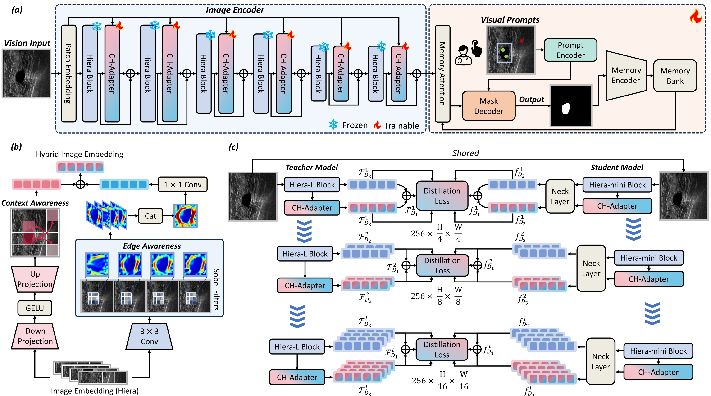

# UniUltra: Interactive Parameter-Efficient SAM2 for Universal Ultrasound Segmentation
<p align="center">
  
</p>


[[`arXiv`]()] 

-------------------------------------------


## 📰News

- **[2025.11.19]** We have released the code for UniUltra!
## 🛠Setup

```bash
git clone https://github.com/xq141839/UniUltra.git
cd UniUltra
conda create -f UniUltra.yaml
```

**Key requirements**: Cuda 12.2+, PyTorch 2.4+, mamba-ssm 2.1.0+

## 📚Data Preparation


The data structure is as follows.
```
UniUltra
├── datasets
│   ├── image_1024
│     ├── BUSI_001.png
|     ├── ...
|   ├── mask_1024
│     ├── BUSI_001.png
|     ├── ...
|   ├── data_split.json
```

## 📜Citation
If you find this work helpful for your project, please consider citing the following paper:


## Acknowledgements

* [SAM2](https://github.com/facebookresearch/sam2)
* [Medical-SAM-Adapter](https://github.com/SuperMedIntel/Medical-SAM-Adapter)


