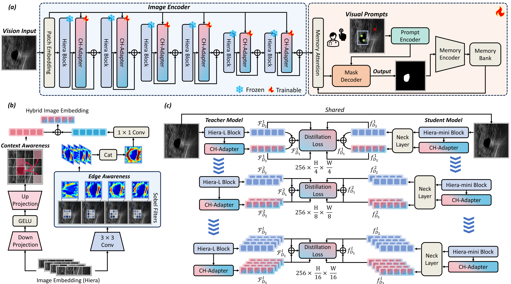

# TMM 2026 | UniUltra: Interactive Parameter-Efficient SAM2 for Universal Ultrasound Segmentation
<p align="center">
  
</p>


[[`arXiv`]()] 

-------------------------------------------


## 📰News

- **[2025.11.19]** We have released the code for UniUltra!
## 🛠Setup

```bash
git clone https://github.com/xq141839/UniUltra.git
cd UniUltra
conda create -f UniUltra.yaml
```

**Key requirements**: Cuda 12.2+, PyTorch 2.4+

## 📚Data Preparation


The data structure is as follows.
```
UniUltra
├── datasets
│   ├── image_1024
│     ├── BUSI_001.png
|     ├── ...
|   ├── mask_1024
│     ├── BUSI_001.png
|     ├── ...
|   ├── data_split.json
```

## 📜Citation
If you find this work helpful for your project, please consider citing the following paper:
```
@article{li2026uniultra,
  title={Uniultra: Interactive parameter-efficient sam2 for universal ultrasound segmentation},
  author={Li, Yue and Xu, Qing and Zhang, Yixuan and He, Xiangjian and Zhang, Qian and Yao, Yuan and Tesem, Fiseha Berhanu and Chen, Xin and Wang, Ruili and Chen, Zhen and others},
  journal={IEEE Transactions on Multimedia},
  year={2026},
  publisher={IEEE}
}
```

## Acknowledgements

* [SAM2](https://github.com/facebookresearch/sam2)
* [Medical-SAM-Adapter](https://github.com/SuperMedIntel/Medical-SAM-Adapter)


